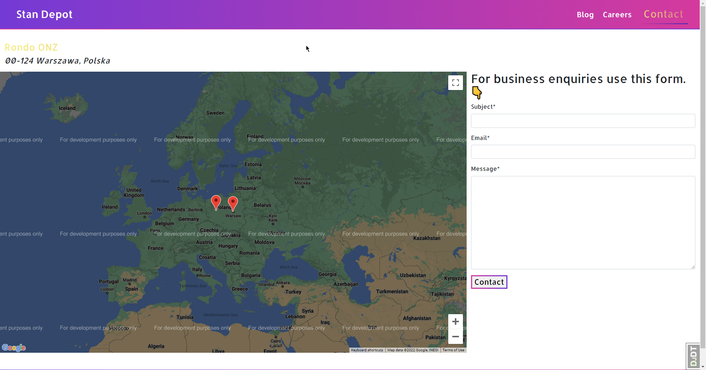

## Table of Contents
1. [Description](#description)
2. [Overview](#overview)
3. [Stack](#stack)
4. [Installation](#installation)
5. [Testing](#testing)
6. [Screenshots](#screenshots)

## <span id="description">Description</span> 
Stan Depot is a project that provides the company with a landing page, blog functionality,
careers pages as well as a contact page with a form.

Blog listing is built using Vue.js as a page as component with an infinite scroll and a REST API.

Admin area is used to create, edit and delete blog posts, has a Markdown syntax support with a live preview.

Careers form has a custom backend validation that checks whether the content-type is correct.

Contact page uses Google Maps API to show the locations of the company. 
You can add locations in the admin area by entering the address or a location name. Based on what you provided the third party API will be used to get the coordinates and all the needed information which can be changed at any time.

## <span id="overview">Overview</span>


## <span id="stack">Stack</span>
- [Python](https://www.python.org/)
- [Django](https://www.djangoproject.com/)
- [Django REST Framework](https://www.django-rest-framework.org/)
- [JavaScript](https://www.javascript.info/)
- [Vue.js](https://vuejs.org/)
- [Google Maps API](https://developers.google.com/maps/documentation/javascript/get-api-key)
- [PyTest](https://docs.pytest.org/en/latest/)
- [PostgreSQL](https://www.postgresql.org/)
## <span id="installation">Installation</span>
Create .env file in the root directory with filled content of the [.env.example](.env.example) file. <br/>
At the very least you need to provide the following variables:
```
DJANGO_SECRET_KEY=secret
DJANGO_DEBUG=True
GOOGLE_API_KEY=your_google_api_key
```

If you are not able to use PostgreSQL, SQLite file will be created and used automatically.
```angular2html
$ python3 -m venv venv
$ source venv/bin/activate
$ python3 -m pip install -r ./requirements/local.txt
$ python3 manage.py migrate
$ python3 manage.py collectstatic --noinput
$ python3 manage.py createsuperuser
$ python3 manage.py runserver_plus
```

## <span id="testing">Testing</span>
To run tests, run `coverage run -m pytest`.


<br/>To generate coverage report, run `coverage html`.


## <span id="screenshots">Screenshots</span> 

|                       Landing Page                        |                       Blog                        |                     Careers                      
|:---------------------------------------------------------:|:-------------------------------------------------:| :-----------------------------------------------------: | 
|  |  | 

|                       Contact                        |                 Business Inquiry thank you page                 |                     Careers thank you page                     
|:----------------------------------------------------:|:---------------------------------------------------------------:| :-----------------------------------------------------: | 
|  |  | 
